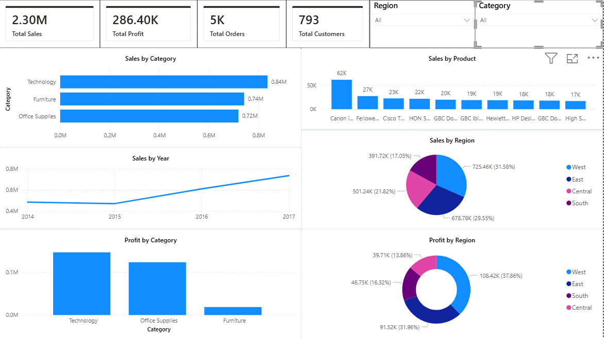

# Sales Performance Dashboard

## Project Overview
This project analyzes retail sales data using Python, Excel, and Power BI to identify sales trends, top-performing products, regional performance, and profitability.

## Tools Used
- Python
- Pandas
- Matplotlib
- Excel
- Power BI

## Dataset
Superstore Sales Dataset

## Project Workflow
1. Data Cleaning using Python
2. Data Analysis using Excel
3. Dashboard Creation using Power BI
4. Business Insights Generation

## Dashboard Features
- Total Sales KPI
- Total Profit KPI
- Total Orders KPI
- Total Customers KPI
- Sales by Category
- Sales by Region
- Profit by Category
- Profit by Region
- Monthly Sales Trend
- Top 10 Products
- Interactive Slicers

## Key Insights
- Technology category generated the highest sales.
- West region achieved the highest revenue.
- Sales increased steadily over time.
- Top products contributed significantly to overall revenue.

## Dashboard Preview

## Author
Ajay

